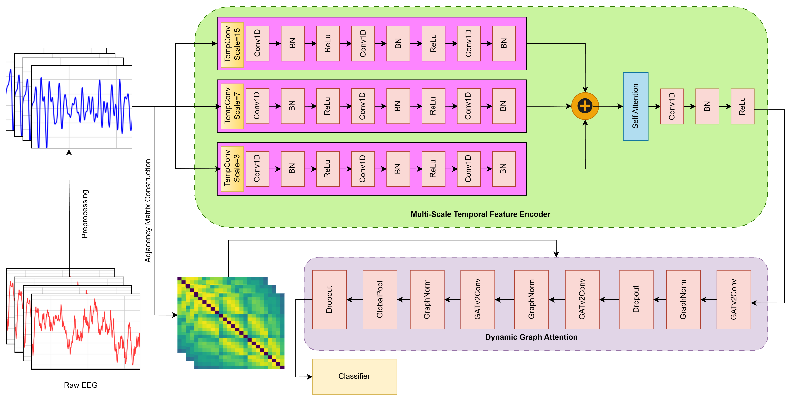

# Rewiring Recognition: Dynamic Graphs for Non-Stationary Stroke EEG


**Affiliation:** Sri Sivasubramaniya Nadar College of Engineering, Anna University, Chennai, India

> **👋 Hello Evaluators!**
>
> Welcome to the digital home of *Rewiring Recognition*! We are thrilled to have you here.
> You've arrived just as we are putting the finishing touches on our repository. We are actively curating our research code to ensure it's crystal clear for your review, so pardon the "wet paint" in a few spots. We hope you enjoy exploring our work on neuroplasticity! 🧠✨

## Overview

This repository contains the implementation of the **Neuroplasticity-Aware Graph Attention Network (NAGAN)**, a deep learning framework designed to decode Motor Imagery (MI) from electroencephalography (EEG) signals in stroke patients.

The deployment of Motor Imagery-based Brain-Computer Interfaces (MI-BCIs) in stroke rehabilitation is often hindered by the non-stationary and asymmetrical neural patterns resulting from post-stroke cortical reorganization. NAGAN addresses this by integrating a multi-scale temporal feature encoder with trial-specific, phase-based functional connectivity graphs. Unlike static models, NAGAN constructs a unique functional topology for every trial, allowing the attention mechanism to adaptively weight connections based on real-time inter-regional synchronization.

### Key Features
*   **Neuroplasticity-Aware Architecture:** Adapts to evolving neural patterns without explicit recalibration.
*   **Dynamic Graph Construction:** Uses Phase-Locking Value (PLV) to build trial-specific functional graphs.
*   **Multi-Scale Temporal Encoding:** Captures temporal dynamics across different scales.
*   **Interpretability:** Attention weights reveal shifts from canonical motor areas to compensatory frontoparietal networks in stroke patients.

## Model Architecture

The NAGAN framework consists of two main phases:

<p align="center">
  
</p>

1.  **Phase 1: Multi-Scale Temporal Feature Encoder (MSTF)**
    *   Extracts temporal dynamics from individual electrodes using parallel 1D convolutional branches with varying kernel sizes (3, 7, 15).
    *   Applies a Channel Attention mechanism to fuse multi-scale features.

2.  **Phase 2: Dynamic Graph Construction & Attention**
    *   Constructs a unique graph for each trial where nodes are electrodes and edges represent functional connectivity (Phase-Locking Value).
    *   Uses Graph Attention Layers (GAT) to dynamically weight connections, allowing the model to adapt to neuroplastic changes.

## Repository Structure

```
.
├── figures/          # Generated figures and plots
├── src/              # Source Jupyter Notebooks for experiments
├── manuscript.tex    # LaTeX source of the paper
└── README.md         # Project documentation
```

## 📂 Code Navigation

Here is how the repository files map to the paper's experiments:

| Paper Section | Experiment | Code File |
| :--- | :--- | :--- |
| **Sec 3.1** | **Benchmark Validation** (PhysioNet) | [`src/mff-plv-gat-physioneteegmidb.ipynb`](src/mff-plv-gat-physioneteegmidb.ipynb) |
| **Sec 3.2** | **Stroke Patient Decoding** (Main Result) | [`src/mff-plv-gat-acutestroke.ipynb`](src/mff-plv-gat-acutestroke.ipynb) |
| **Sec 3.3** | **Channel Sensitivity** (OpenBCI) | [`src/gat-plv-bci-channel-selection-10.ipynb`](src/gat-plv-bci-channel-selection-10.ipynb) (and others) |

### How to Run
1.  Navigate to the `src/` folder.
2.  Open the desired notebook in Jupyter.
3.  **Update the Data Paths**: Look for the `file_path` variable in the first few cells and point it to your local dataset.
4.  Run all cells to reproduce the training and evaluation.

## Installation

### Prerequisites
*   Python 3.8+
*   Jupyter Notebook / Lab

### Dependencies
Install the required Python packages using pip:

```bash
pip install torch torch-geometric mne numpy scipy pandas matplotlib seaborn scikit-learn networkx
```

*Note: `torch-geometric` installation may vary based on your CUDA version. Please refer to the [official documentation](https://pytorch-geometric.readthedocs.io/en/latest/install/installation.html) for specific instructions.*

## Datasets & Configuration

This project utilizes three distinct datasets. **You must download these datasets and update the file paths in the respective notebooks before running them.**

| Dataset | Description | Notebooks |
| :--- | :--- | :--- |
| [**PhysioNet MI Dataset**](https://physionet.org/content/eegmmidb/1.0.0/) | Benchmark healthy subject data (64 channels). | `mff-plv-gat-physioneteegmidb.ipynb` |
| [**Acute Stroke Dataset**](https://doi.org/10.1038/s41597-023-02787-8) | 50 acute stroke patients (29 channels). | `mff-plv-gat-acutestroke.ipynb`<br>`multisubj-mff-plv-gat-acutestroke.ipynb` |
| [**BCI Competition IV 2a**](https://www.bbci.de/competition/iv/#dataset2a) | Healthy subject data (22 channels) used for channel sensitivity analysis. | `gat-plv-bci-channel-selection-*.ipynb` |

### ⚠️ Important: Path Configuration
The notebooks currently contain hardcoded paths (e.g., `/kaggle/input/...`). You **must** locate the data loading section in each notebook and update the `file_path` or `DATA_DIR` variables to point to your local dataset directories.

## Usage

The experiments are organized into separate Jupyter Notebooks in the `src/` directory:

### 1. Benchmark Validation
*   **File:** `src/mff-plv-gat-physioneteegmidb.ipynb`
*   **Description:** Validates the NAGAN architecture on the standard PhysioNet Motor Imagery dataset.
*   **Steps:** Loads EDF files, applies bandpass filtering (8-30Hz), computes PLV matrices, and trains the GAT model.

### 2. Stroke Patient Analysis (Core Experiment)
*   **Files:** 
    *   `src/mff-plv-gat-acutestroke.ipynb` (Single Subject / General)
    *   `src/multisubj-mff-plv-gat-acutestroke.ipynb` (Multi-Subject Loop)
*   **Description:** Demonstrates the model's ability to decode non-stationary stroke EEG.
*   **Steps:** Loads stroke patient data, handles 29-channel configuration, performs data augmentation, and evaluates performance.

### 3. Channel Sensitivity Analysis
*   **Files:** `src/gat-plv-bci-channel-selection-10.ipynb`, `...-12.ipynb`, `...-14.ipynb`
*   **Description:** Evaluates model robustness on reduced channel subsets using the BCI Competition IV 2a dataset.

## Results

*   **PhysioNet:** Achieved ~86.9% accuracy.
*   **Acute Stroke:** Achieved ~89.7% mean accuracy, significantly outperforming static baselines (approx. 70%).
*   **Visual Analysis:** Attention maps confirm the model's ability to track compensatory neural recruitment in the contralesional hemisphere.

## 📝 Todo List

We are continuously improving this repository. Here is our roadmap for the near future:

- [ ] **Refactor Codebase:** Modularize the notebook code into Python scripts for easier reuse.
- [ ] **Add Pre-trained Weights:** Upload checkpoints for the best-performing models on the Stroke dataset.
- [ ] **Extended Documentation:** Add more detailed docstrings and comments to the core model classes.
- [ ] **Docker Support:** Create a Dockerfile for a reproducible environment.

## 🤝 Issues & Feedback

We value your feedback! If you encounter any issues running the code, have questions about the implementation, or spot any bugs, please do not hesitate to:

1.  **Open an Issue:** Use the GitHub "Issues" tab to report problems or suggest enhancements.
2.  **Reach Out:** We are happy to clarify any doubts regarding the methodology or code.

Your input helps us make this research more accessible and robust.

## Citation

If you use this code or dataset in your research, please cite the manuscript when it gets published(hopefully soon!):

```bibtex
@article{sivakumar2024rewiring,
  title={Rewiring Recognition: Dynamic Graphs for Non-Stationary Stroke EEG},
  author={Sivakumar, Janeshvar and Rajaram, Kanchana and R. K., Jothir Aditya},
  journal={Submitted to Springer Nature Annals of Biomedical Engineering},
  year={2024}
}
```
