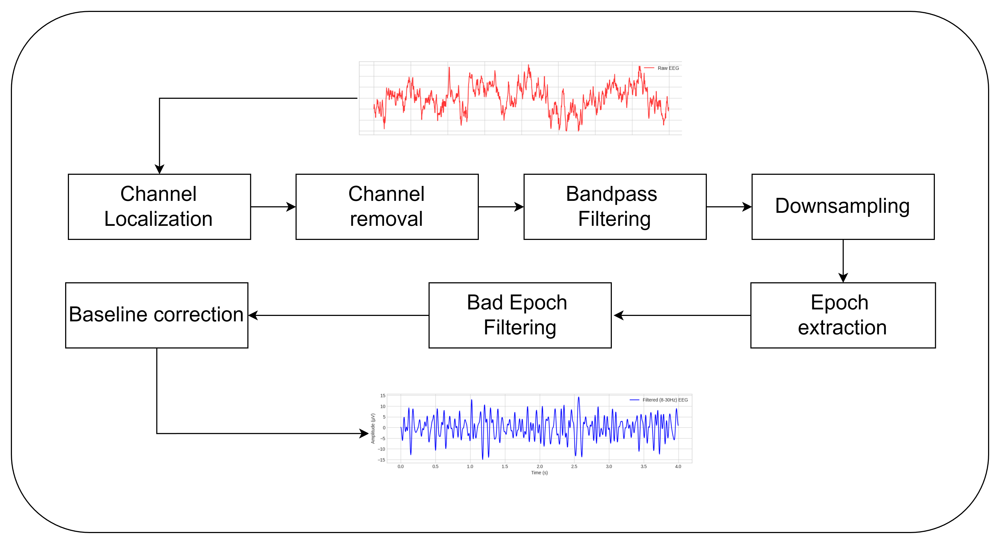
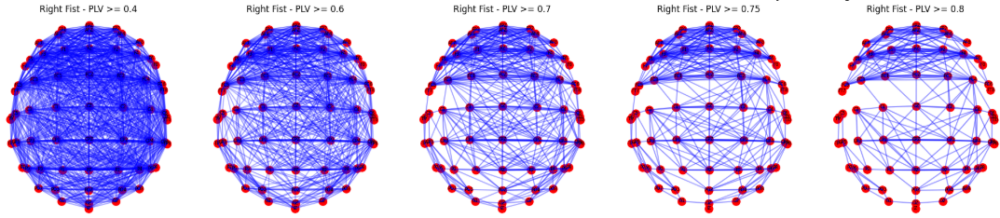
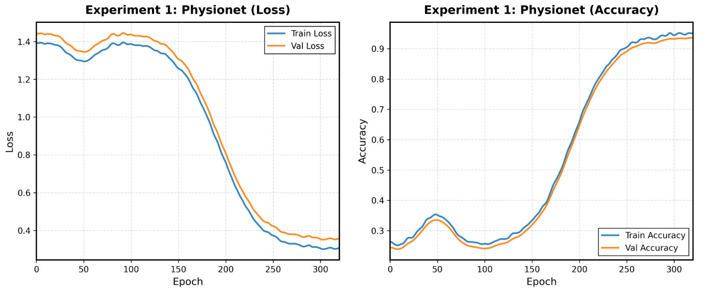
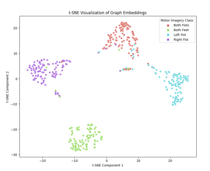
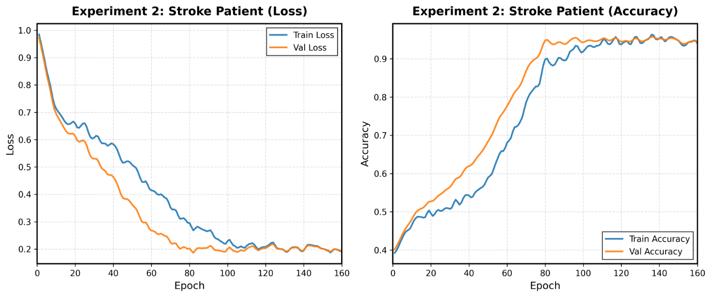
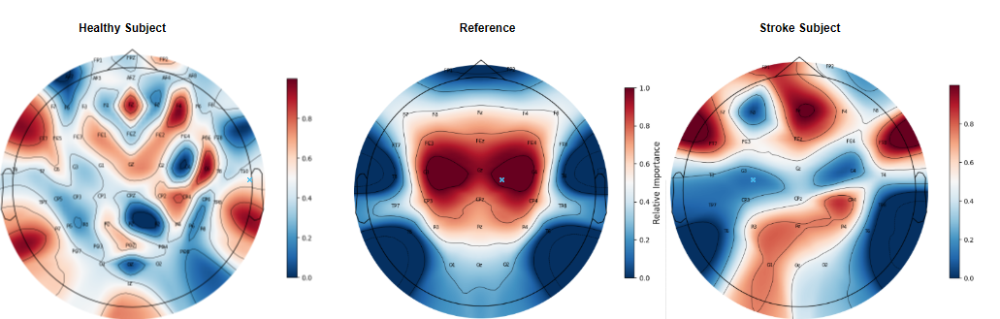
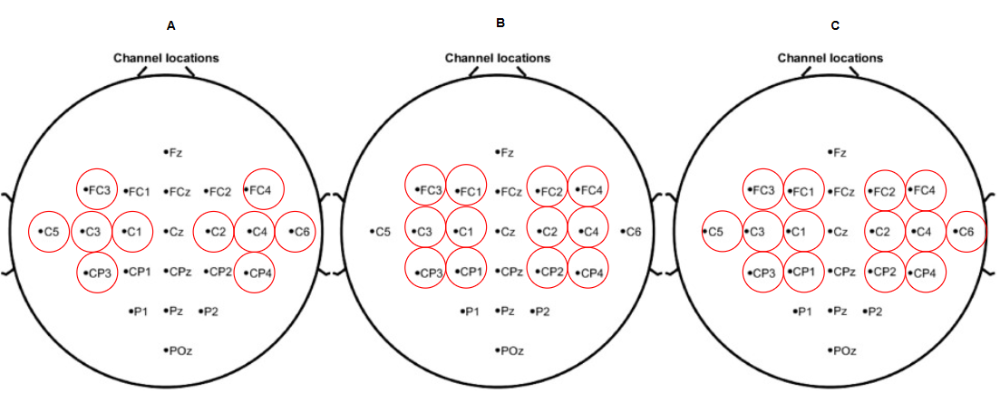

EEG Graph Learning with Multi Step Attention

A complete pipeline for preprocessing, graph construction and graph based deep learning on EEG data.

  
  
  
⭐ About This Project

This repository contains the full implementation of the EEG graph learning framework described in the accompanying manuscript.
It provides dataset preprocessing, graph formation, model definition, training utilities and evaluation tools.

The code is organized for clarity and reproducibility, and all manuscript figures are included for reference.

📌 Key Features

✔ End to end EEG preprocessing

✔ Multi step graph attention model

✔ Physiologically informed edge construction

✔ Training and evaluation scripts

✔ Embedding visualization and utilities

✔ All figures from the paper included under figures/

📁 Repository Structure
project/
│
├── figures/
│   ├── Fig_1_preprocessing_flowchart.png
│   ├── Fig_2_main_architecture.png
│   ├── Fig_3_Edge_formation.png
│   ├── Fig_4_physionetTrianingcurves.png
│   ├── Fig_5_tsnephysionetmsteplvgat.png
│   ├── Fig_6_strokecurves_new1.png
│   ├── Fig_7_topomap.png
│   ├── Fig_8_channelconfig.png
│
├── src/
│   ├── preprocessing/
│   ├── models/
│   ├── utils/
│   └── training/
│
├── configs/
├── requirements.txt
└── README.md

🚀 Installation
git clone <your_repo_url>
cd <your_repo_name>
pip install -r requirements.txt

▶ Quickstart
Train a model
python src/training/train.py --config configs/physionet.yaml

Evaluate a checkpoint
python src/evaluation/eval.py --checkpoint path/to/checkpoint.pt

🧠 Method Summary
Preprocessing Pipeline

  

The pipeline performs filtering, artifact removal, segmentation and normalization.

Model Architecture

  

The architecture uses a multi step graph attention strategy to capture spatial and temporal patterns.

Graph Construction

  

Edges are formed using spatial and functional EEG channel relationships.

📊 Training and Results
Physionet training curves

  

Embedding visualization

  

Stroke dataset training curves

  

🎛 Additional Figures

   

📄 Citation

If you use this code or figures, please cite the accompanying manuscript.

<Insert your BibTeX here>
